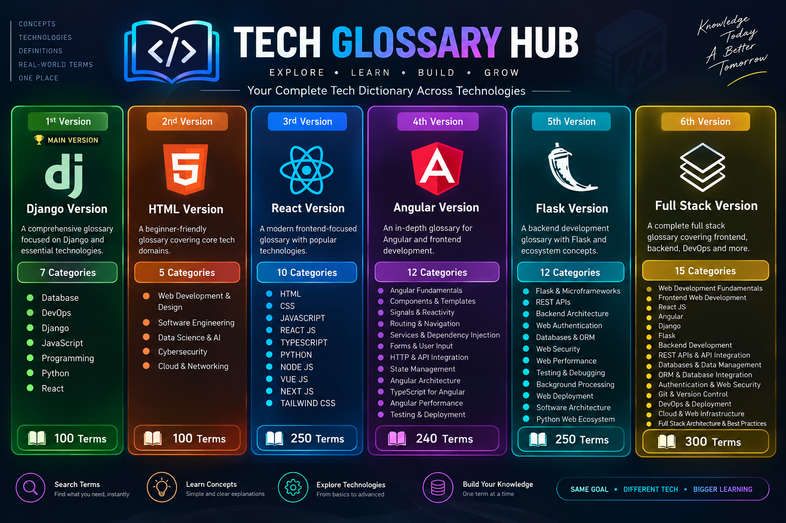

# ⚡ Tech Glossary Hub — Antigravity Edition

<div align="center">


**An interactive 2D physics-based showcase representing the multi-framework evolution of the Tech Glossary Hub ecosystem.**

[Live Demo](https://charanepuri.github.io/tech-glossary-hub-html/) • [Explore Ecosystem](#-ecosystem--versions-matrix) • [Author Profiles](#-author--connect)

</div>

---

## 🚀 Overview

**Tech Glossary Hub — Antigravity Edition** is a modern, interactive web application inspired by Google Antigravity. Built with pure **HTML5**, **CSS3**, **Vanilla JavaScript (ES6+)**, and powered by the **Matter.js 2D physics engine**, it delivers an engaging way to explore the various framework implementations of the Tech Glossary Hub platform.

Initially presenting a clean, structured dashboard with real-time search and category filtering, users can trigger **Zero Gravity** to release DOM elements into a 2D physics world where cards and headers tumble, bounce off viewport boundaries, and can be tossed, flung, and manipulated in real time.

---

## ✨ Key Features

- **🎮 Interactive 2D Physics Engine:** Seamless rigid-body dynamics powered by Matter.js with collision detection, bouncing, and air friction.
- **🖱️ Grab, Drag & Toss Mechanics:** Integrated `MouseConstraint` enables picking up, dragging, throwing, and slamming cards across the screen.
- **🔗 Click-vs-Drag Intelligent Separation:** Smart drag-distance threshold detection ensures external links, live demos, and documentation buttons remain immediately clickable without accidentally triggering a fling.
- **🔍 Real-Time Search & Category Filtering:** Instant multi-field search (matching titles, tags, badges, and descriptions) paired with category filter pills (`All Stacks`, `Frontend`, `Backend`, `Full Stack`, `APIs`).
- **📐 Dual-Mode Compatibility:**
  - _Pre-Gravity:_ Filtering dynamically re-flows the static CSS Grid.
  - _Post-Gravity:_ Non-matching cards smoothly fade and disable pointer events without disrupting active Matter.js physics collisions.
- **↺ Smooth Layout Reset:** Instantly clears physics bodies and gracefully returns all DOM nodes to their computed CSS positions.
- **🎨 Modern, Flat & Zero-Bloat UI:** Crafted with crisp typography (`Inter`), responsive CSS Grid/Flexbox, and zero heavy frameworks.

---

## 🌐 Ecosystem & Versions Matrix

<div align="center">
  
</div>

<br>

| Version                                   | Stack & Scale                                                          |   Status   |                             Live Demo                             |                             Repository                             |                                                                                                                                                                                                                                           Documentation / Updates                                                                                                                                                                                                                                            |
| :---------------------------------------- | :--------------------------------------------------------------------- | :--------: | :---------------------------------------------------------------: | :----------------------------------------------------------------: | :----------------------------------------------------------------------------------------------------------------------------------------------------------------------------------------------------------------------------------------------------------------------------------------------------------------------------------------------------------------------------------------------------------------------------------------------------------------------------------------------------------: |
| **Django Version**<br>_(Main Version)_    | **7 Categories • 45 Terms**<br>Django 6.x, Python 3, SQLite, REST API  |  🟢 Live   |        [Live App](https://tech-glossary-hub.onrender.com/)        |     [GitHub](https://github.com/charanepuri/tech-glossary-hub)     | [Docs (PDF)](https://drive.google.com/file/d/1r-Ta72GE2tjw4qrWlLgztVnjFiAabhdE/view) • [Update 1](https://www.linkedin.com/posts/charan-teja-972aa9231_tech-glossary-hub-progress-update-1-activity-7482807386429100034-EJvP) • [Update 2](https://www.linkedin.com/posts/charan-teja-972aa9231_tech-glossary-hub-progress-update-2-activity-7484464550013067264-lKgf) • [Launch Post](https://www.linkedin.com/posts/charan-teja-972aa9231_tech-glossary-hub-is-now-live-activity-7485551744064749568-i__D) |
| **HTML Version**<br>_(2nd Version)_       | **5 Categories • 100 Terms**<br>HTML5, CSS3, JS, Bootstrap 5           |  🟢 Live   | [Live App](https://charanepuri.github.io/tech-glossary-hub-html/) |  [GitHub](https://github.com/charanepuri/tech-glossary-hub-html)   |                                                                                                                                                                               [Docs (PDF)](https://charanepuri.github.io/tech-glossary-hub-html/assets/TECHGLOSSARYHUBHTML.pdf) • [LinkedIn Post](https://lnkd.in/p/dYVY6fZC)                                                                                                                                                                                |
| **React Version**<br>_(3rd Version)_      | **10 Categories • 250 Terms**<br>React 19, Vite 7, React Router 7      |  🟢 Live   |      [Live App](https://tech-glossary-hub-react.vercel.app/)      |  [GitHub](https://github.com/charanepuri/tech-glossary-hub-react)  |                                                                                                                                                                                                             [Docs (PDF)](https://tech-glossary-hub-react.vercel.app/Tech_Glossary_Hub_React.pdf)                                                                                                                                                                                                             |
| **Angular Version**<br>_(4th Version)_    | **12 Categories • 240 Terms**<br>Angular, TypeScript, Signals, RxJS    |  🟢 Live   |   [Live App](https://tech-glossary-hub-angular.vercel.app/home)   | [GitHub](https://github.com/charanepuri/tech-glossary-hub-angular) |                                                                                                                                                                                                           [Docs (PDF)](https://tech-glossary-hub-angular.vercel.app/Tech_Glossary_Hub_Angular.pdf)                                                                                                                                                                                                           |
| **Flask Version**<br>_(5th Version)_      | **12 Categories • 250 Terms**<br>Python Flask, REST API, Microservices |  🟢 Live   |     [Live App](https://tech-glossary-hub-flask.onrender.com/)     |  [GitHub](https://github.com/charanepuri/tech-glossary-hub-flask)  |                                                                                                                                                                                                 [Docs (PDF)](https://tech-glossary-hub-flask.onrender.com/static/documentation/Tech_Glossary_Hub_Flask.pdf)                                                                                                                                                                                                  |
| **Full Stack Version**<br>_(6th Version)_ | **15 Categories • 300 Terms**<br>Microservices, Unified Auth, CI/CD    | ⚪ Roadmap |                                 —                                 |                                 —                                  |                                                                                                                                                                                                                                                   Planned                                                                                                                                                                                                                                                    |

---

## 🏗️ How It Works (Technical Architecture)

```text
  [ Initial Load: Standard CSS Grid ]
                  │
     User Clicks "Trigger Zero Gravity"
                  │
                  ▼
  [ 1. DOM Measurement ] ──────────────► getBoundingClientRect() on visible elements
                  │
                  ▼
  [ 2. Matter.js World Creation ] ─────► Creates rigid rectangle bodies + static boundary walls
                  │
                  ▼
  [ 3. Layout Conversion ] ────────────► Sets elements to position: fixed at (0, 0)
                  │
                  ▼
  [ 4. Render Sync Loop ] ─────────────► requestAnimationFrame() applies
                                         translate3d(x, y, 0) rotate(rad)
                  │
                  ▼
  [ 5. Mouse Interaction ] ────────────► Matter.MouseConstraint connects pointer to bodies
```

### Key Engineering Details

1. **DOM-to-Physics Coordinate Mapping:** Exact bounding boxes (`rect.left`, `rect.top`, `rect.width`, `rect.height`) are measured before detachment. Matter.js bodies are initialized with centers at `(left + width / 2, top + height / 2)` and randomized angular velocities for organic tumbling.
2. **GPU-Accelerated Transforms:** DOM elements are updated in the render loop using `translate3d(x, y, 0) rotate(rad)` to prevent layout thrashing and maintain 60 FPS.
3. **Viewport Boundaries:** 120px-thick invisible boundary walls are positioned around `window.innerWidth` and `window.innerHeight`. They dynamically reposition on window resize events.
4. **State Cleanliness:** The reset function halts `requestAnimationFrame`, clears the `Matter.Composite` world, stops the `Runner`, and restores original inline CSS styles.

---

## 🛠️ Local Setup & Usage

Since this project uses modern ES6+ features and standard CDN scripts, no complex build steps or installations are required.

### Prerequisites

- A modern web browser (Chrome, Edge, Firefox, Safari).
- A static local server (or VS Code Live Server).

### Steps

1. **Clone the repository:**

   ```bash
   git clone https://github.com/charanepuri/tech-glossary-hub-html.git
   cd tech-glossary-hub-html
   ```

2. **Serve the files:**

   Using Python 3:

   ```bash
   python -m http.server 3000
   ```

   Using Node.js (`npx serve`):

   ```bash
   npx serve .
   ```

   Or simply right-click `index.html` and select **"Open with Live Server"** in VS Code.

3. **Open in your browser:**
   ```text
   http://localhost:3000
   ```

---

## 📁 Project Structure

```text
tech-glossary-hub-antigravity/
├── index.html       # Semantic HTML5 markup, SEO metadata, and card templates
├── style.css        # Clean dark-theme styling, CSS grid, and physics classes
├── app.js           # Matter.js physics engine, search/filter logic, and DOM sync loop
└── README.md        # Project documentation and ecosystem roadmap
```

---

## 👨‍💻 Author & Connect

**Epuri Charan Teja**  
_Aspiring Full Stack Developer_

- 🌐 **Portfolio:** [charan-react-portfolio.vercel.app](https://charan-react-portfolio.vercel.app)
- 💻 **GitHub:** [@charanepuri](https://github.com/charanepuri)
- 🔗 **LinkedIn:** [Charan Teja Epuri](https://www.linkedin.com/in/charan-teja-972aa9231)

---

## 📄 License

This project is licensed under the [MIT License](LICENSE).
